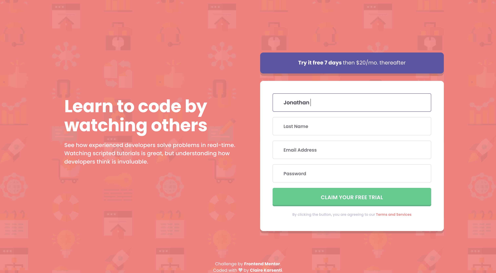
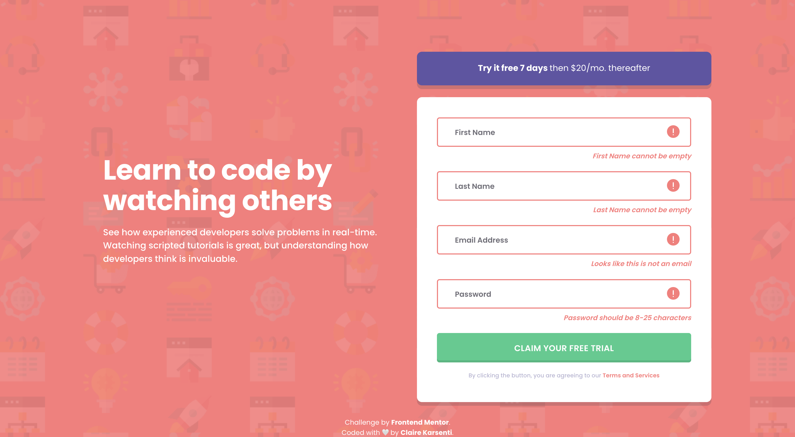

# Frontend Mentor - Intro component with sign-up form solution

This is a solution to the [Intro component with sign-up form challenge on Frontend Mentor](https://www.frontendmentor.io/challenges/intro-component-with-signup-form-5cf91bd49edda32581d28fd1).
Frontend Mentor challenges help me improve my coding skills by building realistic projects.

## Table of contents

- [Frontend Mentor - Intro component with sign-up form solution](#frontend-mentor---intro-component-with-sign-up-form-solution)
  - [Table of contents](#table-of-contents)
  - [Overview](#overview)
    - [The challenge](#the-challenge)
    - [Models & my works](#models--my-works)
      - [Desktop version](#desktop-version)
      - [Mobile version](#mobile-version)
      - [Active states version](#active-states-version)
      - [Demo video](#demo-video)
    - [Links](#links)
  - [My process](#my-process)
    - [Built with](#built-with)
    - [What I learned](#what-i-learned)
    - [Useful resource](#useful-resource)
  - [Setup](#setup)
  - [Author](#author)

## Overview

### The challenge

Users should be able to:

- View the optimal layout for the app depending on their device's screen size
- See hover states for all interactive elements on the page
- Receive an error message when the form is submitted if:
  - Any input field is empty
  - The email address is not formatted correctly

### Models & my works

#### Desktop version

| Model   |            |
| ------- | -------------------------------------------------------------------- |
| My work |  |

#### Mobile version

| Model                                                    | My work                                                            |
| -------------------------------------------------------- | ------------------------------------------------------------------ |
|  |  |

#### Active states version

| Model                      |                  |
| -------------------------- | ------------------------------------------------------------------------------- |
| My work with customization |  |

#### Demo video

https://user-images.githubusercontent.com/102292921/201194722-644076ae-6f74-43a7-9fa4-3524fd468865.mov

### Links

- Solution URL: [Code on GitHub](https://github.com/ClaireKarsenti/Frontend-Mentor-Solution-SignUp-Form)
- Live Site URL: [GitHub Pages Live URL](https://clairekarsenti.github.io/Frontend-Mentor-Solution-SignUp-Form/)

## My process

### Built with

- Semantic HTML5 markup
- CSS Animations
- Styled Components
- React
- TypeScript
- Mobile-first workflow

### What I learned

I choose to do this project in TypeScript language and with the framework React to deepen my skills in these fields.
This challenge also allowed me to deepen my knowledge of CSS Animations and Styled Components for the layout part of this project. Concerning Styled Components, I learned that I can passes through all props, I have used it especially when inputs fields were empty.

Here are some example of my code and some of my customization I added to this project:

- :nail_care: Passed props with Styled Components for the inputs fields:

  ```css
  export const Input = styled.input`
  /* [...] */
  &:invalid ~ ${Error} {
    display: ${(props: any) => props.focused && 'block'};
  }
  &:invalid {
    border: ${(props: any) => props.focused && '2px var(--red) solid'};
    background: ${(props: any) =>
      props.focused && `url(${ErrorIcon}) no-repeat`};
    margin-bottom: ${(props: any) => props.focused && '0.5rem'};
    background-position: bottom 15px right 20px;
  }
  `;
  ```

- :arrows_counterclockwise: I customized the submit button with a flip button effect:

  ```html
  <button className="flip" type="submit">
    <div className="inner">
      <div className="front">Claim your free trial</div>
      <div className="back">Let's Go!</div>
    </div>
  </button>
  ```

  ```css
  .flip .inner {
    position: relative;
    width: 100%;
    height: 100%;
    transition: transform 1s;
    transform-style: preserve-3d;
    pointer-events: none;
  }
  .flip:hover .inner {
    transform: rotateX(180deg);
  }
  .inner .front,
  .inner .back {
    position: absolute;
    backface-visibility: hidden;
    width: 100%;
    height: 100%;
    letter-spacing: 0.27px;
    line-height: 26px;
    font-size: 1rem;
    font-weight: var(--semiBold);
    color: var(--white);
    text-transform: uppercase;
  }
  .inner .front {
    background: transparent;
  }
  .inner .back {
    background: transparent;
    transform: rotateX(180deg);
  }
  ```

### Useful resource

[Resource 1](https://styled-components.com/docs/basics#passed-props) - This helped me for passed props with Styled Components.

## Setup

To run this project, install it locally using yarn:

```
yarn install && yarn start
```

## Author

- Linkedin - [Claire Karsenti](https://www.linkedin.com/in/claire-karsenti/)
- Frontend Mentor - [@ClaireKarsent](https://www.frontendmentor.io/profile/ClaireKarsenti)
